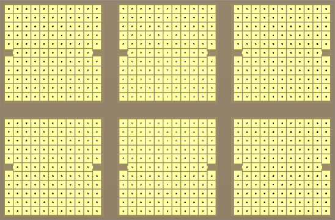
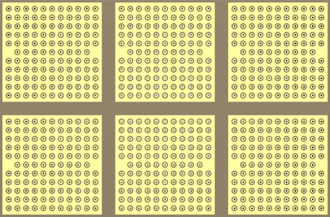
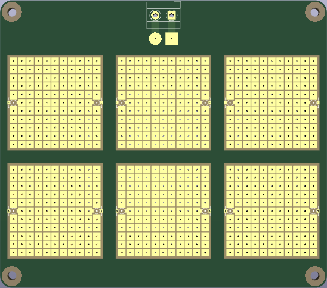
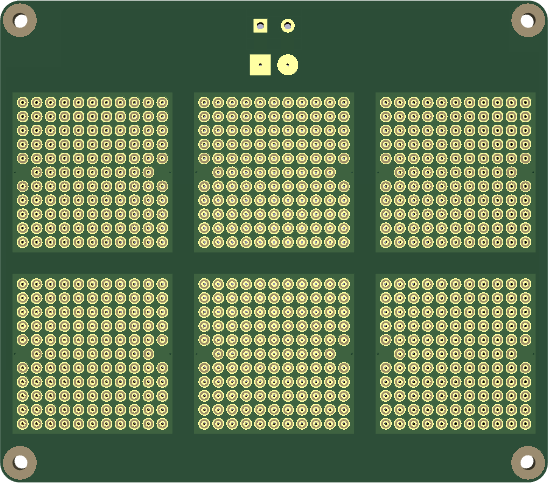

# RF prototyping boards

When designing radio frequency (RF) circuits, we cannot rely on traditional perfboards or breadboards. Suitable boards need a [ground plane](https://en.wikipedia.org/wiki/Ground_plane#Printed_circuit_boards)  (essential for reducing noise in RF circuits), and should have minimal parasitic capacitances and inductances. Breadboards are especially unsuited, due to their RF circuit altering parasitics (mainly created by the horizontal signal rails, and the vertical power rails).

In the same vein, RF protoboards should support SMT components, which have less parasitic inductance compared to their leaded counterparts.

*This repository presents boards suitable for prototyping RF circuits, [ready to be sent](#fabricating-the-rf-proto-boards) to a PCB manufacturer.*

## Original work (ExpressPCB only)

[MegawattKS](https://www.youtube.com/@MegawattKS) gives an accessible [radio design lecture (YouTube)](https://www.youtube.com/watch?v=r_p7AHsSOdw&list=PL9Ox3wpnB0kqekAyz6blg4YdvoEMoJNJY), with [matching slides](https://ecefiles.org/radio-design-101-slides/), and an accompanying guide detailing [how to prototype RF circuits](https://ecefiles.org/rf-circuit-prototyping/).
It's quite a useful course for getting hands on experience and a non-math heavy intuition, using (comparatively) affordable tools, which are introduced as well: [NanoVNA and TinySA for radio design (YouTube)](https://www.youtube.com/watch?v=B7DFOq9rM_M&list=PL9Ox3wpnB0koBGofotI4xS8R0ct0FeYfv).

When you don't happen to have access to the very expensive RF equipment of a university laboratory, this course is ideal, as it was designed to measure and characterize the built RF circuits with the NanoVNA and the TinySA in mind. (Tools which are widely used in DIY/amateur communities, and accordingly have lots of documentation, tutorial videos, and useful addons available online.)

There is also a more advanced university level course ["Designing and Building Transmitters and Receivers"](https://ecefiles.org/rf-circuits-course-notes/) and its [part list](https://ecefiles.org/wp-content/uploads/2023/01/000b_ECE662_PartsList_F19.pdf).

Finally, MegawattKS kindly provided his [original design for ExpressPCB Plus](/original/RFprotoboard_Rev2_17nov22.rrb), which I used to take measurements of the various footprints and layout dimensions.

## Derived work (KiCad, many PCB manufacturers)

I faithfully redesigned the RF protoboard in KiCad, based on those measurements, to enable fabricating them with pretty much any PCB manufacturer.
The manual conversion was necessary, since the original boards are made for ExpressPCB, which uses a format exclusive to this manufacturer, with no export/import options. 

This resulted in two boards (out of the many variations I tried):

- The [standard version](/RF_ProtoBoard), with all the original dimensions and features being kept.

  

    
    
Front
    
  

   

  

    
    
Back

  

- The [extended version](/RF_ProtoBoard_Extended), with the following changes compared to the standard version:
  - **added**: mounting holes
  - **added**: screw terminal for power (and pads to solder power wires onto)
  - **extended**: complete 4 pad U.FL connector footprints with silkscreen (for easier alignment)
  - **changed**: ground rings instead of a fully exposed ground plane
    - solder mask only exposes ground rings around the backside of plated through holes; ground rings should form nicer solder joints and hopefully ease solderability to the ground plane

   
  
  

    
    
Front
    
  

   

  

    
    
Back

  

  
The screw terminal on the extended version reduces the amount of loose wires going off the board. Now, all the power wires from the 6 sub-modules can be routed to the centrally positioned pair of power pads, which have traces leading to the single central power screw terminal. The power pads on the backside of the board allow to add a decoupling/bulk capacitor.

## Fabricating the RF proto boards

The necessary ZIP files are available in the [fabrication directory](fabrication/), ready to be sent to a PCB manufacturer.
They are tuned for JLCPCB, but you can easily  [adjust the settings](Manufacturing.md#generating-files-manually) as needed when generating the Gerber, drill and map files from within the KiCad projects.

### PCB ordering website options

- *Extended board version:* inform your manufacturer to keep the silkscreen for the U.FL connectors, since it's on the bare PCB substrate (no solder mask underneath). To do so, write a note in the order page remark field: "Keep the silkscreen on the solder mask openings."
- Select "Untented" for "Via Covering".
- *JLCPCB only*: under "Remove Order Number", select "Specify a location". The "JLCJLCJLCJLC" text on the B.Silkscreen layer [specifies the location of the order number](https://jlcpcb.com/help/article/50-How-to-remove-order-number-from-your-PCB).

### Fabrication results, generating files manually, reviewing production files

I received my first extended RF protoboards on October 9, 2023. All tests indicate they are working well -- I made continuity tests with my multimeter -- and they were manufactured to specification regarding silkscreen, drilled hole diameters and correct through hole plating to the ground planes.

More details on how to generate Gerber files manually, my experiences with producing the extended board version, and how to review production files before fabrication begins, can be found under [manufacturing](Manufacturing.md).

## Soldering to the ground plane rings

In the first practical soldering tests, the ground ring design proved to be really easy to use for connecting pads to ground.

Either solder only to the inner ring on the backside to mechanically secure a through hole component to the board, without connecting it to the ground plane, or make a larger solder dome/blob that also covers the outer ground ring to make a ground plane connection.

No special or large sized tip is necessary: I use a 2 mm wide chisel tip, with my soldering station set to about 330°C, using Sn100Ni+ 0.5mm solder wire (see [recommended lead-free solder](NecessaryToolsAndParts.md#recommended-lead-free-solder)).

The only tricky part is to remove solder from the narrow plated through holes, so it is better to plan ahead if you want a throughhole component or a surface mount component on a specific pad.

### Soldering in more detail

Add some solder to the inner ring, then swirl the iron tip around the inner ring and the outer ground ring at the same time and add more solder to make a larger blob/dome. Initially it only bonds to the inner ring, but after a few seconds of swirling, the ground plane ring will also accept the solder. If the joint looks "cold"/crumbly, simply add a little flux and touch up the joint again briefly, so it will create a nice shiny joint.

### Removing a ground connection

Heat up a solder joint and collect excessive solder with the iron's tip, then brush it off on your brass wool cleaner. With less solder it will tend to only cover the inner ring, which means there is no more connection to ground.

Alternatively, use a solder sucker: keep the iron on the rings until the solder melts, then move the iron slightly off the center of the rings, but close enough, so it can keep the solder in a molten state. Then make the (silicone!) tip of the solder sucker touch directly the iron tip, and press the button of the desoldering pump to suck most of the solder away. It works quite reliably, and better than using solder wick.

The solder sucker tip should be made out of silicone, so it doesn't melt when touching the soldering iron.

## Parts and measurement equipment

Aside from measurement equipment, such as the NanoVNA and the TinySA, you will need U.FL connectors, screw terminals, and most importantly, surface mount components, to build RF circuits. See the [list of tools and parts needed](NecessaryToolsAndParts.md).

## Recommended literature

- RF Circuit Design 2nd Edition by Christopher Bowick
  - https://www.amazon.de/RF-Circuit-Design-Christopher-Bowick/dp/0750685182/
- Impedance Measurement Handbook -- A Guide to Measurement Technology and Techniques 
  - https://www.keysight.com/us/en/assets/7018-06840/application-notes/5950-3000.pdf
- https://hexandflex.com/2020/01/11/impedance-matching-with-qucs-studio-and-vna/
- https://www.gunthard-kraus.de/qucsstudio/Tutorial_Qucsstudio_V1-7_M%C3%A4rz%202019.pdf
- https://www.gunthard-kraus.de/fertig_NanoVNA/Deutsch/Nano_H_Deutsch_2020.pdf
- https://www.grund-wissen.de/elektronik/simulationen-mit-qucs.html
- https://electronics.stackexchange.com/questions/677822/s-parameters-calculation-from-vna-file
- https://qucs-help.readthedocs.io/de/qucs-0.0.18/start.html
- https://passive-components.eu/capacitors-losses-esrimpdfq/
- [HP - S-Parameter Techniques for Faster, More Accurate Network Design](http://www.sss-mag.com/pdf/an-95-1.pdf)

## Related perfboard designs

- https://github.com/electroniceel/protoboard
- https://github.com/jamesmunns/brick-mount
- https://github.com/hyves42/miniboard-protoboard
- https://github.com/mje-nz/protoboard
- https://github.com/AriaSalvatrice/synth-protoboard
- https://hackaday.com/2016/06/16/evaluating-the-unusual-and-innovative-perf-protoboard/
- https://www.busboard.com/SP3T-50x50-G-PTH
  - https://www.amazon.com/SP3T-50X50-G-PTH-SMTpads-3U-Thin-Plated-Ground-50x50mil/dp/B00LLPRNVW
